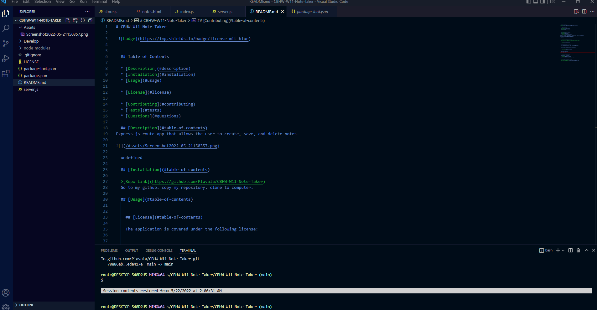

# CBHW-W11-Note-Taker

 
    

  ## Table-of-Contents

  * [Description](#description)
  * [Installation](#installation)
  * [Usage](#usage)
  
  * [License](#license)
    
  * [Contributing](#contributing)
  * [Tests](#tests)
  * [Questions](#questions)
  
  ## [Description](#table-of-contents)
Express.js route app that allows the user to create, save, and delete notes.
  
  ['shot of the program']

 
 [shot of the code]
 
  

  ## [Installation](#table-of-contents)

  >[Repo Link](https://github.com/Plavala/CBHW-W11-Note-Taker) 
  Go to my github. copy my repository. clone to computer. 
  heroku link :  https://nameless-plains-02668.herokuapp.com

  ## [Usage](#table-of-contents)

  
    ## [License](#table-of-contents)
  
    The application is covered under the following license:
  
    
    [mit](https://choosealicense.com/licenses/mit)
      
      

  ## [Contributing](#table-of-contents)
  
  
  Tray (class instructor) 
  Molly (class mate)
    

  ## [Tests](#table-of-contents)

  open index html with browser

  ## [Questions](#table-of-contents)

  Please contact me using the following links:

  [GitHub](https://github.com/Plavala)

  [Email: Oscar.cdbs@gmail.com](mailto:Oscar.cdbs@gmail.com)
